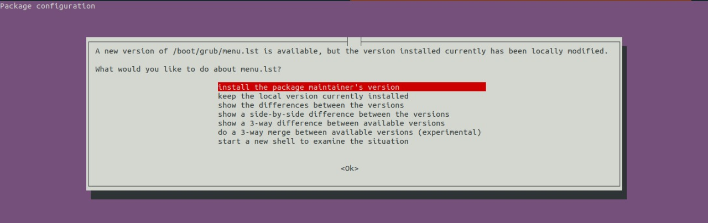

# my5GCore-install

my5G-core is a fork of the free5GC project, with some extensions to facilitate the deployment. The main go od this project is automated the process of installation throught Ansible.

**Steps**

Install python-minimal:
```
sudo apt update && apt -y install python-minimal
```

Install git:
```
sudo apt -y install git
```

Clone this repository:
```
git clone https://github.com/ciromacedo/my5GCore-install.git
```

Install Ansible:
```
sudo apt -y install ansible
```

Install Ansible-Galaxy Golang role:
```
ansible-galaxy install abdennour.golang
```

Check your kernel version with ```uname -r```, if the result is less then ```5.0.0-23-generic``` run the following:
```
sudo apt-get install -y linux-image-5.0.0-23-generic
```
In the action menu that appears, choose the first option "__install the package maintainer's version__" like as illustrated in the figure below, and after reboot the system.

<p align="center">
     
</p>


Run the following Ansible playbook (password for sudo is required):
```
cd my5GCore-install && ansible-playbook -K my5GInstall.yml
```
