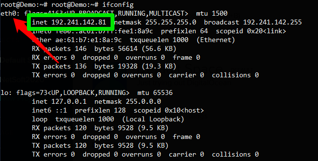

# 5GCore-easy-install

The main objective of this project is to automate the installation process of [my5GCore](https://github.com/my5G/my5G-core) or [free5GC](https://github.com/free5gc/free5gc) projects, through Ansible.

**Steps**

Install python-minimal:
```
sudo apt update && apt -y install python-minimal && sudo apt -y install git && sudo apt -y install ansible
```


Clone this repository:
```
git clone https://github.com/ciromacedo/5GCore-easy-install.git
```

Install GOLang:
```

cd 5GCore-easy-install &&  ansible-playbook -K install-golang.yml
source ~/.bashrc
```

Check your kernel version with ```uname -r```, if the result is less then ```5.0.0-23-generic``` run the following:
```
sudo apt-get install -y linux-image-5.0.0-23-generic
```
In the action menu that appears, choose the first option "__install the package maintainer's version__" like as illustrated in the figure below, and after reboot the system.

<p align="center">
     
</p>

Run ```ifconfig``` and get the name of **internet network interface**, like as illustrated in the figure below:
<p align="center">
     
</p>


Run the following Ansible playbook (password for sudo is required):

### free5gc
```
cd 5GCore-easy-install && ansible-playbook -K free5gc-Install.yml -e  "internet_network_interface=<< internet network interface name>>"
```

### Start NFs Functions
```
NRF > UDR > UDM > AUSF > NSSF > AMF > PCF > UPF (sudo -E ./bin/free5gc-upfd) > SMF > SERVER-WEB > SERVER-FRONT-END ( REACT_APP_HTTP_API_URL=http://core_ip_address:5000/api PORT=3000 yarn start )
```

## Instalação / Configuração do Tester

1 - Instalar GO (Usar 5GEasyInstall)

2 - Clonar o repositório e instalar o GO
```
git clone https://github.com/my5G/my5G-RANTester.git

wget https://dl.google.com/go/go1.14.4.linux-amd64.tar.gz
sudo tar -C /usr/local -zxvf go1.14.4.linux-amd64.tar.gz
mkdir -p ~/go/{bin,pkg,src}
echo 'export GOPATH=$HOME/go' >> ~/.bashrc
echo 'export GOROOT=/usr/local/go' >> ~/.bashrc
echo 'export PATH=$PATH:$GOPATH/bin:$GOROOT/bin' >> ~/.bashrc
source ~/.bashrc
```

3 - Instalar as dependencias
```
cd my5G-RANTester && go mod download
```


3 - Gerar os binários
```
cd cmd && go build app.go
```

4 - Editar o arquivo de configuração ** config/config.yml**
4.1 - Setar o IP para conexão com AMF:
``
amfif:
  ip: "127.0.0.1"
  port: 38412
  name: "free5gc"
``

4.2 COnfigurar os parametros de acesso do UE
``
key: "8baf473f2f8fd09487cccbd7097c6862"
  opc: "8e27b6af0e692e750f32667a3b14605d"
  amf: "8000"
``

5 Após registrar o UE no Core a inicialização de um UE simples pode ser feita dentro da pasta **cmd** com:
``
./app ue
``
6 Se tudo estiver OK será gerada uma interface de rede com nome **uetun1** e um PING pode ser realizado com:
``
 ping google.com -I uetun1
``


### Truques do Tester
1 - remover um aquivo q fica em /root/tem chamad gnb.sock
2 - as vezes tem q remover as interfaces de rede com esses comandos:
    ip link set uetun1 down
    ip link del uetun1

3 para verificar se o ping está realmente funcionando usar o seguinte comando:
    tshark - i <<interface-rede>>   --> o wireshark vai capturar os pacotes da interface
    ip r --> mostra as rotas e mostra tambem que qualquer pacote que chegar na máquina vai p/ a eth0 que é a default.
    
    ip route add 8.8.8.8 via 60.60.60.0.1 dev uetun1  --> cria uma rota de modo que todo pacote que chega com destino 8.8 é encaminhado p/ a interface ETUN1 ao invés de ir p/ o ETH0.

     --> deleta a rota anterior

    Para que o PING com 'nomedosite.com' funcione, basta descobrir o IP do site alvo a adicionar uma rota com o seguinte comando:
    ip route add <colocar-o-ip-aqui> via 60.60.0.1 dev uetun1

    Para remover uma rota adicionada com o comando anterior basta executar:
    ip route del <colocar-o-ip-aqui> via 60.60.0.1 dev uetun1

    
